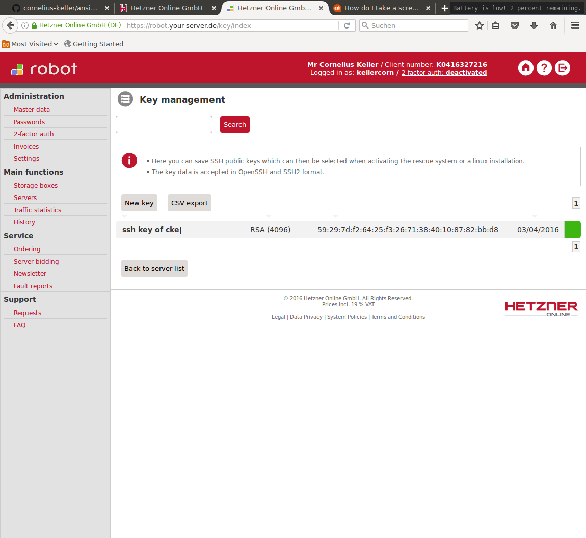
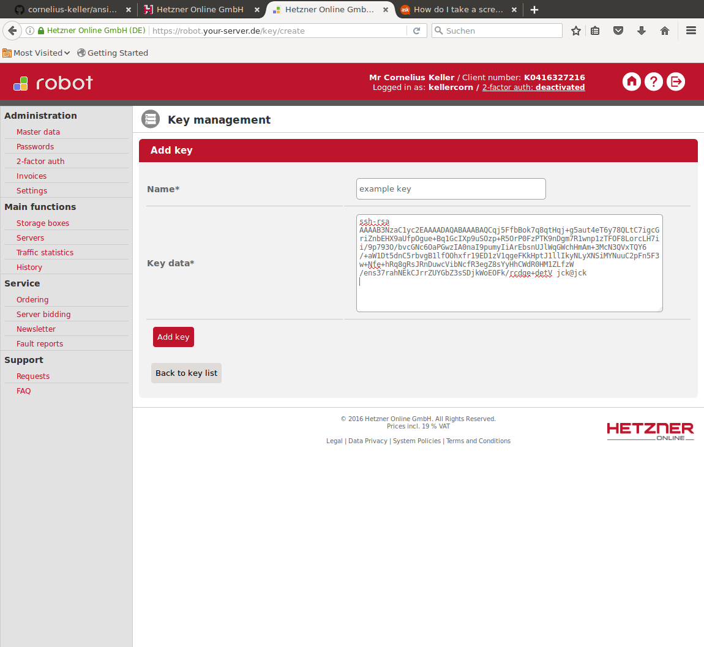
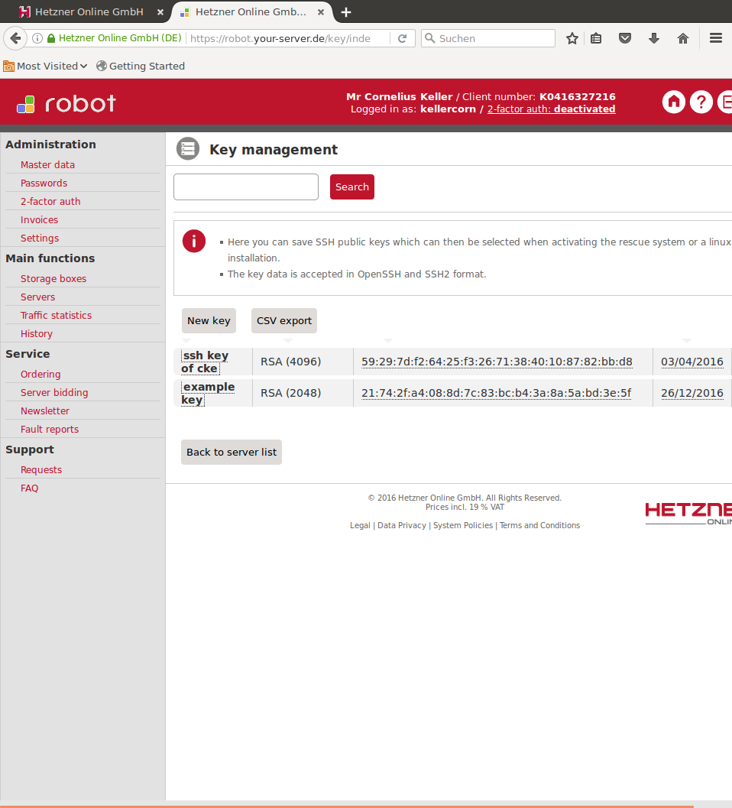

# Get, run and contibute #
## Get the code ##

Requirement: This code is using ansible to bootstrap and update kerbernetes environment. Please ensure that ansible is installed on the machine you will run the code.

The code could be retrieved from github using the following command
```
git clone https://github.com/cornelius-keller/ansible-coroeos-kubernetes
```
You should now retrieve the submodules used by this code. 

```
#go to the source repository
cd ansible-coreos-kubernetes
git submodule init 
git submodule update
```

Finally the current code depends on ansible-coreos-bootstrap module which requires the following command to be run

```
ansible-galaxy install sigma.coreos-bootstrap
```

--- be aware that this command should be run with root privileges to update /etc/ansible/roles ---


You are now ready to use the application to bootstrap a new cluster and later to update it. 

## Bootstrap a cluster ##

Bootstraping a cluster will install coreos on each node of the cluster. After coreos installation, boostrapping will install and configure ceph, etcd, docker, kubernetes with kubectl.
Bootstrap is performed using the ansible playbook bootstrap_coreos.yml.

### Preparation ###

Before bootstraping you need to get at least three dedicated servers. 
Curently hetzner, ovh and kimsufi should be supported. Deployment on lacal servers should be also supported. Please refer to Supported providers for detailed informations.

Get the IP adresses of all your node and start to create a new inventory.ini file. 
A sample ini file is provided on the root folder.

#### Create a new ini file ####

1. Edit the etcd-node and set the IP address and the hostname for all your nodes. It is recommend to strat with three etcd nodes and no etc-proxy.
2. Edit kubernetes-master section and set the IP adresses. For high Availability it is recommended to have 2 master node.
3. Edit kubernetes-node and set the IP addresses. Adresses of nodes that should not be kubernetes master.
4. Edit the ceph-mon section and set the IP adresses. IP Adresses of ceph nodes that will act as Monitor. Ceph recommend to have an ood number of monitors. Therefore for high availablity it is recommend to have 3 monitors (not more as monitors generate some overload)
5. Edit the ceph-osd section and set IP adresses. ceph osd nodes will act as storage nodes for ceph.
6. Edit the all:vars section and set:
	a. the kube_master (FQDN) dns name [Optional]
	b. the kube_master IP address (being one of the IP defined in kubernetes-master section)
	c. the kube_cluster_name if needed
	d. change baremetal_provider and set webservice username and password if needed.
	e. change python_interpreter if needed
> REMARK: why ansible_python_interpreter is also defined in some playbook
	f. set the ceph_fsid with a new UUID. UUID can be generated with the uuidgen shell command.
	g. set the ceph_key with key generated usinf the ceph-key.py script provided
	h. set ceph osd type and parameters. Currently there is no ceph_osd_type supported:
		* type is directory which mean that osd will use a directory for its partition. You must ensure that the following parameters are set in the ini file:  
			ceph_osd_type=os_directory
			ceph_osd_path=<path to a local dir>
		* type is disk which means that a fill disk will be used for osd partition. You must ensure that the following parameters are set in the ini file:
			ceph_osd_type=os_disk
			ceph osd drive=<path to a device (e.g. /dev/sdb) >
	Finally set the parameters specific to your provider (Please refer to the provider section for detailed informations)		
	i. copy the fingerprint public ssh key to be used in rescue mode.

#### etcd-ca #####

the bootstrap process requires to have etcd-ca tool installed. Yoiu can validate etcd-ca installation by using the following command

```
which etcd-ca
```
If you have no ouput you must perform the following steps otherwhise you can go directly to next step:

To build etcd-ca:

```
$ git clone https://github.com/coreos/etcd-ca
$ cd etcd-ca
$ ./build
```
this will build etcd-ca in the ./bin folder.
ensure that this etcd-ca is in the path or create a symbolic link to have it in the path.


### Supported providers ###
#### Hetzner ####
Find below some spefic steps required to use this playbook with hetzner provider

##### upload ýour public key to Hetzner
* Log into the the Hetzner robot.
* Navigate to the server list in the left menu.


* chose key management
  
* chooose new key, give it a name, and copy the output of

  `cat ~/.ssh/id_rsa.pub`

 into the form and save it.
 

* copy the id of the key for use in the inventory. 

##### Create a webservice account
* create a robot account and copy the username and password into the inventory.


  For Example:

      hetzner_webservice_username=#ws+7FPjagF7
      hetzner_webservice_password=<your password>

This webservice username, password and the fingerprint of the rescue key to be provided in the hetzner section of the inventory.ini

#### OVH ####
> TO BE DONE


### Launch bootstrap process ###

Ensure that you run ansible version 2.1 or greater. You can check it using the command:

```
ansible --version
```

Launch the bootstrap process using the following command:

```
ansible-playbook -i /<path to your inventory file/> bootstrap_coreos.yml
```

the playbook should finish without any errors.

### Check your new cluster ###

#### 1. Check ssh connection ####
You should be able to connect to each node of your cluster using ssh without password (authentication is done using ssh key). Use the following command to check:

```
	ssh core@<ip_address of your node>
```

Expected result: You should be able to connect to each of your node as core without password.

#### 2. Check etcd cluster healthiness ####
Connect to one of your node using ssh and run the following command

```

```
